# Частина 1 — проєктування схеми
### ASCII-діаграма
```text
+------------------------+      RATED      +------------------------+    HAS_GENRE    +----------------------+
|          User          |---------------->|         Movie          |---------------->|        Genre         |
+------------------------+     rating      +------------------------+                 +----------------------+
| id: Integer            |    timestamp    | id: Integer            |                 | name: String         |
| gender: String         |                 | title: String          |                 +----------------------+
| age: Integer           |                 +------------------------+                     
| occupation: String     |
+------------------------+
```
У графі використовуються три типи вузлів:`User`, `Movie`, `Genre` 

Між ними створено два типи зв’язків:
- `RATED` — користувач оцінив фільм;
- `HAS_GENRE` — фільм належить до жанру.

Один користувач може оцінити багато фільмів, а один фільм може бути оцінений багатьма користувачами:

`(User)──[:RATED]──▶(Movie)`

Один фільм може належати до декількох жанрів, а один жанр може містити багато фільмів:

```text
(Movie)
│
├──[:HAS_GENRE]──▶ (Action)
├──[:HAS_GENRE]──▶ (Comedy)
└──[:HAS_GENRE]──▶ (Drama)
```
Зв’язок `RATED` має властивості `rating` і `timestamp`, оскільки ці дані описують не самого користувача або фільм, а конкретний факт оцінювання певного фільму певним користувачем.
****
## 1. Які сутності стали вузлами, а які — ребрами? Чому?

У побудованій графовій моделі **вузлами** стали: `User`, `Movie`, `Genre`,

User, Movie та Genre є самостійними сутностями. Кожна з них може існувати незалежно від іншої і має власний набір властивостей та зв'язків. 

**Ребрами** стали:
```
(User)-[:RATED]->(Movie) — користувач оцінив фільм;
(Movie)-[:HAS_GENRE]->(Genre) — фільм належить до жанру.
```
RATED та HAS_GENRE описують взаємодію між сутностями, тому вони представлені ребрами.
Властивості rating і timestamp належать саме факту оцінювання конкретним користувачем конкретного фільму, тому зберігаються у зв’язку RATED.
***
## 2. Оцінка користувача за фільм — це ребро (User)-[:RATED]->(Movie) чи окремий вузол (Rating)?

Оцінка користувача за фільм представлена як ребро:
`(User)-[r:RATED]->(Movie)`

з властивостями:
```
r.rating
r.timestamp
```
Оцінка описує безпосередню взаємодію між двома сутностями — користувачем і фільмом.
Саме ребро відповідає на запитання: _**«Який користувач оцінив який фільм?»**_, а його властивості показують, яку оцінку було поставлено і коли.

Переваги представлення оцінки як ребра:
- не потрібно створювати окремий вузол, оскільки оцінка існує лише як зв'язок між конкретним користувачем і конкретним фільмом, а не як самостійна сутність;
- граф містить менше вузлів і зв'язків, тому займає менше пам'яті;
- запити стають простішими, оскільки не потрібно переходити через додатковий вузол Rating;
- швидше виконуються обходи графа, що особливо важливо для рекомендаційних алгоритмів;

***
## 3. Чому жанри фільму вигідніше зберігати як окремі вузли (Genre), а не як список у властивості вузла Movie?
Жанри представлені окремими вузлами `Genre`, а не списком у властивості `Movie`. 
Це дозволяє зробити жанр повноцінною сутністю графа, через яку можна виконувати обходи та аналізувати зв'язки між фільмами.

Основні переваги такого підходу:
- не потрібно дублювати назви жанрів у кожному вузлі `Movie`;
- унікальність жанрів забезпечується через constraints (`Genre.name IS UNIQUE`);
- легко знайти всі фільми певного жанру;
- можна знаходити схожі фільми за спільними жанрами;
- до вузла `Genre` можна додати власні властивості (опис, популярність, піджанри тощо) без зміни структури вузла `Movie`;

Також окремі вузли `Genre` значно спрощують побудову рекомендацій. Наприклад, можна легко знайти користувачів, які полюбляють певний жанр, або рекомендувати фільми зі спільними жанрами через обходи графа.

Можливим недоліком такого підходу може стати те, що популярні жанри можуть стати супервузлами, оскільки з ними буде пов'язано дуже багато фільмів.
Однак для цього набору даних це не є суттєвою проблемою.
***

# Частина 2 — Завантаження даних

Спочатку були створені обмеження унікальності (`CREATE CONSTRAINT ... IS UNIQUE`) для користувачів, фільмів і жанрів.
Це дозволяє не тільки уникнути створення дублікатів, а й автоматично створює індекси. Завдяки цьому під час виконання `MATCH` і `MERGE` пошук користувачів та фільмів відбувається значно швидше, без повного перегляду всіх вузлів.
```text
CREATE CONSTRAINT users_unique_idx IF NOT EXISTS
FOR (u:User) REQUIRE u.id IS UNIQUE;

CREATE CONSTRAINT movies_unique_idx IF NOT EXISTS
FOR (m:Movie) REQUIRE m.id IS UNIQUE;

CREATE CONSTRAINT genre_unique__idx IF NOT EXISTS
FOR (g:Genre) REQUIRE g.name IS UNIQUE;
```

Всі дані по фільмам, юзерам та оцінкам завантажуються з файлів movies.csv, users.csv та ratings.csv відповідно.

Для створення вузлів і зв'язків використовувався `MERGE`, а не `CREATE`. Це робить скрипт ідемпотентним: якщо запустити його повторно, вже існуючі вузли та зв'язки не будуть створюватися повторно.

Під час завантаження фільмів список жанрів розділяється за допомогою split(..., '|'), а оператор UNWIND обробляє кожен жанр окремо. 
Якщо відповідний вузол Genre ще не існує, він створюється, після чого фільм зв'язується з ним через ребро HAS_GENRE.

Оскільки таблиця оцінок містить дуже велику кількість записів, зв'язки `RATED` завантажуються за допомогою `apoc.periodic.iterate`. Дані обробляються пакетами по 10 000 записів, що дозволяє уникнути переповнення пам'яті та проблем із довгими транзакціями.

**Перевірка рехультатів:**

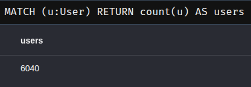

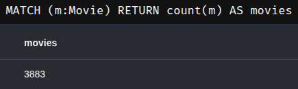

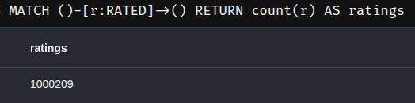

***
#  Частина 3 — Запити різної складності

### Запит 1. Знайти всі фільми жанру «Thriller» із середнім рейтингом вище 4.0:
```cypher
MATCH (m:Movie)-[:HAS_GENRE]->(:Genre {name: "Thriller"})
MATCH (u:User)-[r:RATED]->(m)
WITH m, avg(r.rating) AS avg_rating
WHERE avg_rating > 4
RETURN m.title, avg_rating
ORDER BY avg_rating DESC;
```

- **`MATCH` + `HAS_GENRE`** — знаходить усі фільми жанру **Thriller**.
- **`MATCH` + `RATED`** — отримує всі оцінки цих фільмів.
- **`WITH avg(r.rating)`** — обчислює середній рейтинг для кожного фільму.
- **`WHERE avg_rating > 4`** — залишає лише фільми з високою середньою оцінкою.

Результат (фрагментований вивід):

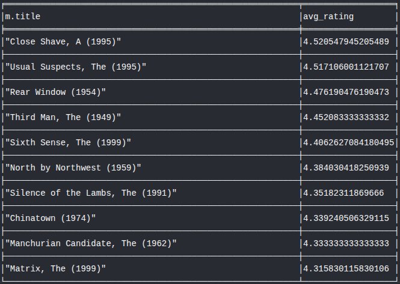
***
### Запит 2. Знайти користувачів, які поставили оцінку 5 більш ніж 50 фільмам:

```cypher
MATCH (u:User)-[r:RATED]->(m:Movie)
WHERE r.rating = 5
WITH u, count(m) AS movies_count
WHERE movies_count > 50
RETURN u.id, movies_count
ORDER BY movies_count DESC;
```

- **`MATCH` + `RATED`** — знаходить усі оцінки користувачів.
- **`WHERE r.rating = 5`** — залишає лише максимальні оцінки.
- **`WITH count(m)`** — підраховує кількість фільмів, яким кожен користувач поставив оцінку 5.
- **`WHERE movies_count > 50`** — відбирає лише найбільш активних користувачів.

Результат (фрагментований вивід):

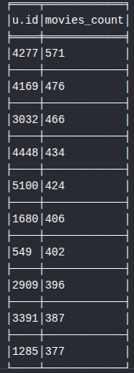
***
### Запит 3. Знайти фільми, які обидва користувачі (наприклад, userId=1 і userId=2) оцінили високо (рейтинг ≥ 4):
```cypher
MATCH (u:User)-[r:RATED]->(m:Movie)
WHERE r.rating >= 4 AND u.id IN [1, 2]
WITH m, count(DISTINCT u) AS users_count
WHERE users_count = 2
RETURN m.title
```

- **`MATCH` + `RATED`** — знаходить усі оцінки користувачів.
- **`WHERE r.rating >= 4 AND u.id IN [1, 2]`** — залишає лише оцінки двох заданих користувачів, що не менші за 4.
- **`WITH count(DISTINCT u)`** — підраховує, скільки з цих користувачів високо оцінили кожен фільм.
- **`WHERE users_count = 2`** — залишає лише ті фільми, які високо оцінили **обидва** користувачі.

Результат:


***
### Запит 4. Знайти жанри, чиї фільми стабільно отримують високі оцінки — середній рейтинг і кількість оцінок:
```cypher
MATCH (m:Movie)-[:HAS_GENRE]->(g:Genre)
MATCH (u:User)-[r:RATED]->(m)
WITH g, avg(r.rating) AS avg_rating, count(r) AS ratings_count
WHERE avg_rating > 3.7 AND ratings_count >= 1000
RETURN g.name, avg_rating, ratings_count
ORDER BY avg_rating DESC;
```

- **`MATCH` + `HAS_GENRE`** — знаходить жанри для кожного фільму.
- **`MATCH` + `RATED`** — отримує всі оцінки цих фільмів.
- **`WITH avg(r.rating), count(r)`** — обчислює середній рейтинг і загальну кількість оцінок для кожного жанру.
- **`WHERE avg_rating > 3.7 AND ratings_count >= 1000`** — залишає лише популярні жанри зі стабільно високими оцінками.

Результат:

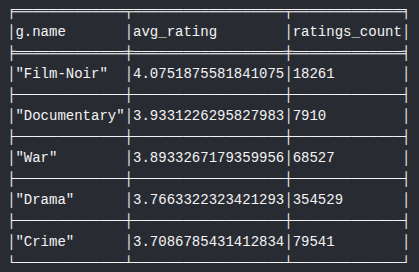
***
### Запит 5. Рекомендація «користувачі зі схожими смаками також дивилися»: для заданого користувача знайти фільми, які він ще не дивився, але високо оцінили користувачі з подібними смаками:
```cypher
MATCH (u:User {id: 5})-[r:RATED]->(m:Movie)
WHERE r.rating >= 4

MATCH (u2:User)-[r2:RATED]->(m)
WHERE u <> u2 AND r2.rating >= 4

MATCH (u2)-[r3:RATED]->(recommended:Movie)
WHERE r3.rating >= 4
  AND NOT EXISTS {
    MATCH (u)-[:RATED]->(recommended)
  }

WITH recommended,
     count(DISTINCT u2) AS similar,
     avg(r3.rating) AS avgRating
RETURN recommended.title,
       similar,
       avgRating
ORDER BY similar DESC, avgRating DESC
LIMIT 10;
```

- **Перший `MATCH`** — знаходить фільми, які користувач **5** оцінив не нижче **4**.
- **Другий `MATCH`** — знаходить інших користувачів, які також високо оцінили ці самі фільми.
- **Третій `MATCH`** — знаходить інші фільми, які ці користувачі також оцінили не нижче **4**.
- **`NOT EXISTS`** — виключає фільми, які користувач **5** вже дивився.
- **`count(DISTINCT u2)`** — підраховує, скільки схожих користувачів рекомендують кожен фільм.
- **`avg(r3.rating)`** — обчислює середню оцінку рекомендованого фільму.

Результат:

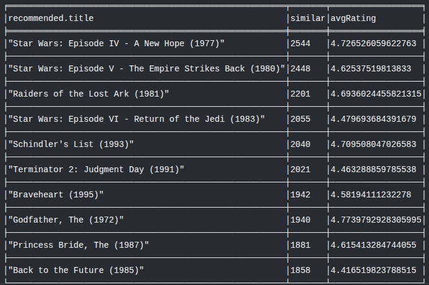

***
### Запит 6. Знайти найкоротший ланцюжок зв’язку між двома користувачами
```cypher
MATCH (u1:User {id: 1}), (u2:User {id: 2})
MATCH path = shortestPath((u1)-[:RATED*]-(u2))
RETURN path, length(path) AS pathLength;
```

- **Перший `MATCH`** — знаходить двох користувачів, між якими потрібно побудувати шлях.
- **`shortestPath((u1)-[:RATED*]-(u2))`** — знаходить найкоротший шлях між ними, проходячи по зв'язках `RATED` будь-якої довжини (`*`).
- **Ненаправлений зв'язок `-[:RATED*]-`** дозволяє рухатися по графу в обох напрямках.
- **`length(path)`** — обчислює кількість ребер у знайденому шляху.

Результат:

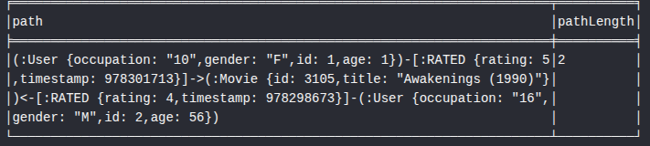

### 1. Що означає довжина шляху в даному контексті?

Довжина шляху — це кількість ребер, які потрібно пройти, щоб дістатися від одного вузла до іншого. У нашому випадку - це це кількість ребер `RATED`, через які потрібно пройти, щоб дістатися від одного користувача до іншого.

### 2. Один хоп — це один крок по ребру RATED, а значить — шлях довжини 2 означає, що два користувачі оцінили один і той самий фільм.

Так, якщо довжина шляху дорівнює 2, це означає, що користувачі мають спільний фільм, який вони обидва оцінили. Тобто один перехід по ребру RATED

### 3. Як інтерпретувати шлях довжини 4? Довжини 6?

Оскільки шлях проходить через користувачів і фільми, його довжина показує, скільки "посередників" між двома користувачами.

Довжина 4:

`User1 ── MovieA ── User3 ── MovieB ── User2`

User1 і User2 не мають спільного фільму, але пов'язані через іншого користувача.

Довжина 6:

`User1 ── MovieA ── User3 ── MovieB ── User4 ── MovieC ── User2`

Між користувачами вже два проміжні користувачі (User3 і User4).

**Чим менша довжина шляху, тим ближче користувачі пов'язані між собою за своїми вподобаннями.**
***
# Частина 4 — Виявлення супервузлів

```cypher
MATCH (u:User)-[r:RATED]->(:Movie)
RETURN u.id AS userId,
       count(r) AS degree
ORDER BY degree DESC
LIMIT 5;
```

- **`MATCH (u)-[r:RATED]->(:Movie)`** — знаходить усі зв'язки `RATED` для кожного користувача.
- **`count(r)`** — підраховує кількість оцінок, тобто степінь (degree) вузла `User`.

Чим більше значення `degree`, тим більше зв'язків має вузол і тим ближче він до статусу **супервузла**.

Результат:

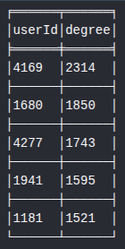

```cypher
MATCH (:User)-[r:RATED]->(m:Movie)
RETURN m.id, m.title, count(r) AS degree
ORDER BY degree DESC
LIMIT 5;
```

- **`MATCH (:User)-[r:RATED]->(m:Movie)`** — знаходить усі зв'язки `RATED`, що ведуть до кожного фільму.
- **`count(r)`** — підраховує кількість оцінок, тобто степінь (degree) вузла `Movie`.

Результат:

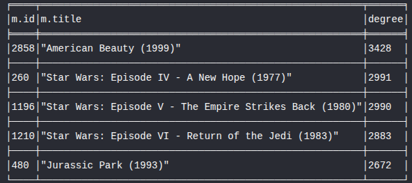

```cypher
MATCH (m:Movie)-[rel:HAS_GENRE]->(g:Genre)
RETURN g.name, count(rel) AS degree
ORDER BY degree DESC
LIMIT 5;
```

- **`MATCH (m)-[rel:HAS_GENRE]->(g)`** — знаходить усі зв'язки між фільмами та жанрами.
- **`count(rel)`** — підраховує кількість фільмів, що належать до кожного жанру, тобто степінь (degree) вузла `Genre`.

Результат:

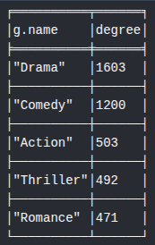

**Загальний пошук вузлів із найбільшою кількістю зв’язків**
```cypher
MATCH (n)
WITH n, count { (n)--() } AS degree
RETURN
    labels(n) AS labels,
    CASE WHEN n:User THEN n.id END AS userId,
    CASE WHEN n:Movie THEN n.id END AS movieId,
    CASE WHEN n:Movie THEN n.title
         WHEN n:Genre THEN n.name
    END AS name,
    degree
ORDER BY degree DESC
LIMIT 10;
```
- **`MATCH (n)`** — перебирає всі вузли графа.
- **`count { (n)--() }`** — підраховує загальну кількість зв'язків (degree) для кожного вузла.
- **`CASE WHEN`** — дозволяє коректно відобразити інформацію залежно від типу вузла (`User`, `Movie` або `Genre`).

Результат:

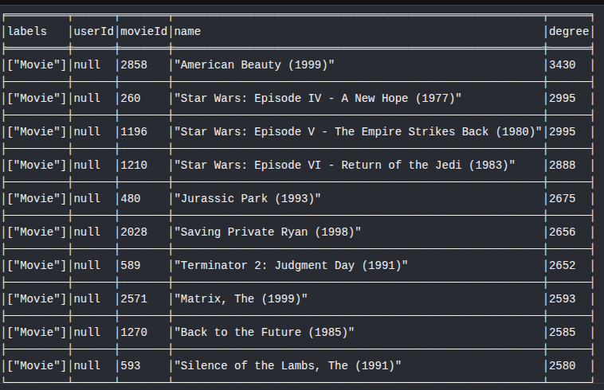
***
### 1. Які вузли виявилися супервузлами? Скільки у них зв’язків?
Супервузлами виявилися переважно вузли Movie, оскільки вони мають найбільшу кількість зв'язків RATED із користувачами.

Найбільшим супервузлом виявився фільм `American Beauty (1999)` з 3430 зв'язками.
***
### 2. Чому запит, що зачіпає такий вузол, працює повільніше, ніж запит по «звичайному» вузлу з тими самими індексами?
Запит, який проходить через супервузол, виконується повільніше, тому що після знаходження самого вузла потрібно переглянути **набагато більше зв'язків**.
Індекс допомагає лише **швидко знайти вузол**, але не прискорює обхід його ребер. Наприклад, знайти фільм *American Beauty (1999)* за `id` індекс може миттєво, але після цього Neo4j все одно повинен пройти всі **3430** зв'язків `RATED`, щоб обробити запит.
***
### 3. Яку конкретну стратегію з лекцій ви б застосували для цього датасету?

Вузли **Genre** також потенційно можуть стати супервузлами. Наприклад, жанр **Drama** пов'язаний із **1603** фільмами, **Comedy** — із **1200**, а **Action** — із **503**.

Для такого випадку я б застосувала стратегію **«розділяй і володарюй»**. Тобто розбивати дані на менші групи.

Наприклад, жанри можна додатково розділити за **роком випуску** фільмів. Замість одного вузла `Drama` можна використовувати вузли на кшталт `Drama_1980s`, `Drama_1990s`, `Drama_2000s`. Тоді кожен із них матиме значно менше зв'язків, а обходи графа стануть швидшими.
 
Або ж можна розподілити жанри за **діапазонами середнього рейтингу** фільмів. Наприклад, окремо можна виділити групи `Drama (rating ≥ 4.5)`, `Drama (4.0–4.5)` та `Drama (< 4.0)` і тд. 

Вибор стратегії вже залежить від конкретних запитів і цілей.
***
# Частина 5 — Графові алгоритми через GDS
### 5.1. PageRank на графі фільмів
```cypher
CALL gds.pageRank.stream('movieGraph',  {
    relationshipWeightProperty: 'weight'
  })
YIELD nodeId, score
RETURN gds.util.asNode(nodeId).title AS name, score
ORDER BY score DESC
LIMIT 10;
```

- **`gds.pageRank.stream('movieGraph')`** — запускає алгоритм PageRank для проєкції графа `movieGraph`.
- **`relationshipWeightProperty: 'weight'`** — враховує вагу зв'язків `CO_RATED`. Сильніші зв'язки мають більший вплив на обчислення PageRank
- **`YIELD nodeId, score`** — повертає ідентифікатор вузла та його PageRank.
- **`gds.util.asNode(nodeId).title`** — перетворює `nodeId` назад у вузол Neo4j та отримує назву фільму.

Результат:

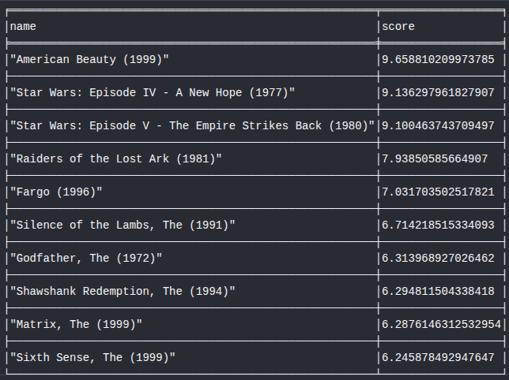

### Що означає високий PageRank для фільму в цьому графі? Це просто “популярний фільм” чи щось інше?
Високий **PageRank** означає, що фільм є **важливим вузлом у графі схожості**, а не просто популярним, оскільки враховується не лише кількість зв'язків, а й те, **з якими саме фільмами він пов'язаний**.

Високий PageRank отримують фільми, які:
- мають багато зв'язків з іншими фільмами;
- займають центральне місце в мережі схожих уподобань користувачів.

Таким чином, високий **PageRank** характеризує не лише популярність фільму, а й його **центральність у графі схожих фільмів**.
***
### 5.2. Виявлення спільнот (Louvain)
```cypher
CALL gds.louvain.write(
    'userSimilarity',
    {
        relationshipWeightProperty: 'weight',
        writeProperty: 'communityId'
    }
)
YIELD communityCount, modularity, modularities
RETURN communityCount, modularity, modularities;
```
- **`gds.louvain.write('userSimilarity')`** — запускає алгоритм Louvain на проєкції графа `userSimilarity`.
- **`relationshipWeightProperty: 'weight'`** — враховує вагу зв'язків `SIMILAR`, тобто кількість спільних фільмів, які користувачі оцінили на 5.
- **`writeProperty: 'communityId'`** — записує ідентифікатор знайденої спільноти у властивість `communityId` кожного вузла `User`.
- **`YIELD communityCount, modularity, modularities`** — повертає інформацію про результати роботи алгоритму.

Результат:

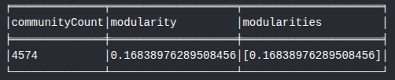
- **`communityCount`** — кількість знайдених спільнот.
- **`modularity`** — показник якості поділу графа на спільноти. Чим він вищий, тим кращий результат.
- **`modularities`** — значення модульності, отримані алгоритмом під час його роботи.
- 
Алгоритм **Louvain** виявив **4574 спільноти** користувачів. Значення **modularity = 0.168** є невисоким, тому спільноти не дуже добре відокремлені одна від одної. Це свідчить про те, що користувачі мають багато спільних зв'язків між різними групами, а чітко виражених кластерів у графі небагато.

**10 найбільших кластерів**
```cypher
MATCH (u:User)
WHERE u.communityId IS NOT NULL
RETURN u.communityId, count(u) AS userCount
ORDER BY userCount DESC
LIMIT 10;
```

- **`MATCH (u:User)`** — знаходить усіх користувачів.
- **`WHERE u.communityId IS NOT NULL`** — залишає лише тих користувачів, для яких алгоритм Louvain визначив спільноту.
- **`count(u)`** — підраховує кількість користувачів у кожній спільноті.

Результат:

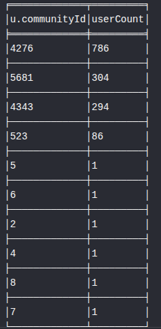

За результатами видно, що розподіл різко нерівномірний — 3 великих кластери, 1 середній і всі інші складаються лише з одного користувача.

Це свідчить про те, що в графі є кілька великих груп користувачів зі схожими вподобаннями, але значна частина користувачів має слабкі зв'язки з іншими і не утворює великих кластерів. 

**Найпопулярніші жанри фільмів серед спільнот**
```cypher
MATCH (u:User)
WHERE u.communityId IS NOT NULL
WITH u.communityId AS communityId, count(u) AS communitySize
ORDER BY communitySize DESC
LIMIT 10

MATCH (user:User {communityId: communityId})-[r:RATED]->(m:Movie)-[:HAS_GENRE]->(g:Genre)
WHERE r.rating >= 4
WITH communityId, communitySize, g.name AS genre, count(*) AS ratings_count
ORDER BY communityId, ratings_count DESC

WITH communityId,
     communitySize,
     collect({genre: genre, ratings_count: ratings_count})[0..3] AS topGenres
RETURN communityId, communitySize, topGenres
ORDER BY communitySize DESC;
```

- **Перший блок `MATCH`** — підраховує розмір кожної спільноти.
- **Другий `MATCH`** — знаходить фільми, оцінені користувачами цих спільнот.
- **`WHERE r.rating >= 4`** — враховує лише фільми, які користувачам сподобалися.
- **`count(*) AS ratings_count`** — підраховує кількість високих оцінок для кожного жанру всередині спільноти.
- **`collect(...)[0..3]`** — збирає жанри у список і залишає перші три.

Результат:

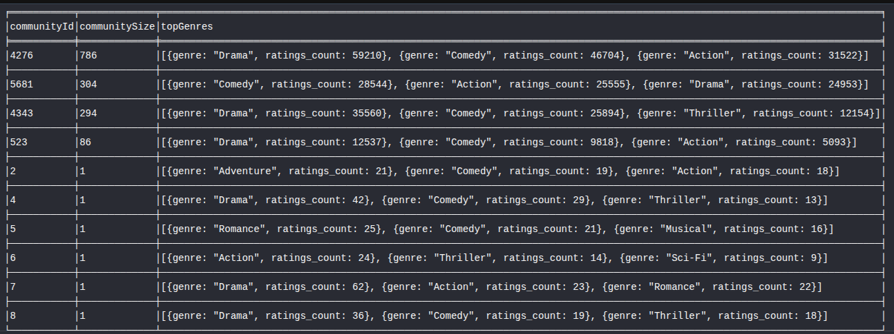

У більшості великих кластерів найпопулярнішими є жанри **Drama** та **Comedy**, проте третій за популярністю жанр відрізняється.
В одних кластерах це **Action**, в інших — **Thriller**, що свідчить про відмінності у смаках користувачів.

Малі спільноти, які складаються з одного користувача, мають власні унікальні вподобання, але робити загальні висновки на їх основі недоцільно через дуже малий розмір.
***
### 5.3. Найкоротший шлях між користувачами
```cypher
MATCH (source:User {id: 18}),
      (target:User {id: 2125})
CALL gds.shortestPath.dijkstra.stream(
  'userGraph',
  {
    sourceNode: source,
    targetNode: target
  }
)
YIELD totalCost, nodeIds
RETURN
  totalCost,
  [nodeId IN nodeIds | gds.util.asNode(nodeId).id] AS userPath;
```

- **`MATCH`** — знаходить початкового та кінцевого користувачів.
- **`gds.shortestPath.dijkstra.stream`** — запускає алгоритм пошуку найкоротшого шляху.
- Вага ребер не вказана, тому кожен зв’язок `SIMILAR` має однакову вартість.
- **`totalCost`** — показує загальну кількість переходів у знайденому шляху.
- **`nodeIds`** — містить вузли, через які проходить шлях.
- **`userPath`** — повертає `id` користувачів у порядку проходження шляху.

Результат:

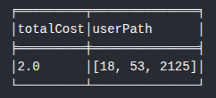

Чим менше проміжних вузлів у знайденому шляху, тим ближче користувачі розташовані у графі схожості. 
Оскільки ваги ребер у запиті не враховуються, результат показує саме найменшу кількість переходів, а не найсильнішу схожість.

### 1. Наскільки «тісний світ» у цьому датасеті? Спробуйте кілька пар користувачів.
Спробуємо знайти пари пов'язаних користувачів
```cypher
MATCH (u1:User), (u2:User)
WHERE id(u1) < id(u2)

MATCH p = shortestPath((u1)-[:SIMILAR*]-(u2))

RETURN u1.id AS user1,
       u2.id AS user2,
       length(p) AS hops
LIMIT 10;
```
Результат:

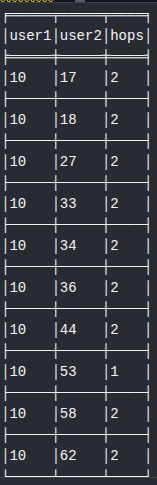

Граф користувачів містить як **тісно пов'язані групи**, так і **окремі незв'язані компоненти**.

Для деяких пар користувачів алгоритм знаходив прямий зв'язок без проміжних вузлів, що свідчить про схожі вподобання. 
Водночас для інших пар шлях не знаходився, оскільки під час побудови графа були використані обмеження (враховувалися лише оцінки **≥ 4** або **5**).

### 2. Яка середня довжина шляху? Чи підтверджується гіпотеза «шести рукостискань»?
У межах даного датасету середня довжина шляху між усіма парами користувачів не обчислювалася, оскільки це потребує значних обчислювальних ресурсів.

Проте результати експерименту показали, що для більшості перевірених пар користувачів найкоротший шлях складає **1–2 переходи**. Наприклад, користувач **10** має прямий зв'язок із користувачем **53** (1 перехід), а з користувачами **17**, **18**, **27**, **33**, **34**, **36**, **44**, **58** та **62** — через одного проміжного користувача (2 переходи). В цьому випадку гіпотеза «шести рукостискань» підтверджується.

Це свідчить про те, що всередині зв'язаної компоненти граф є досить щільним, а користувачі зі схожими вподобаннями знаходяться на невеликій відстані один від одного.
Водночас для деяких пар користувачів шлях може бути відсутній.
***
# Частина 6 — Аналіз і висновки

Більшість простих запитів із частини 3 можна реалізувати в SQL. Наприклад, пошук фільмів певного жанру, обчислення середнього рейтингу або пошук користувачів, які залишили багато оцінок, виконуються за допомогою звичайних операцій JOIN, GROUP BY і HAVING.

Значно складніше в SQL реалізувати рекомендаційну систему або пошук найкоротшого ланцюжка між двома користувачами, оскільки заздалегідь невідомо, скільки переходів міститиме шлях.

Якщо довжина шляху фіксована, у SQL довелося б декілька разів приєднувати таблицю ratings до самої себе. Наприклад, для пошуку ланцюжка виду:

`User1 → Movie → User → Movie → User2`

можна використати такий запит:
```sql
SELECT DISTINCT
r1.user_id AS user1,
r4.user_id AS user2
FROM ratings r1
JOIN ratings r2
ON r1.movie_id = r2.movie_id
AND r1.user_id <> r2.user_id
JOIN ratings r3
ON r2.user_id = r3.user_id
JOIN ratings r4
ON r3.movie_id = r4.movie_id
AND r3.user_id <> r4.user_id
WHERE r1.user_id = 1
AND r4.user_id = 2;
```
Такий запит перевіряє лише шлях конкретної, наперед заданої довжини. Для пошуку довших шляхів потрібно було б додавати нові операції JOIN. Це ускладнює запит і може призводити до створення великої кількості проміжних результатів, що збільшує витрати пам’яті та час виконання.

Якщо довжина шляху невідома, SQL-запит також теоретично можливий за допомогою рекурсивного CTE. Проте він буде значно складнішим за відповідний Cypher-запит. Необхідно вручну:

- організувати рекурсивний обхід;
- зберігати вже відвіданих користувачів;
- запобігати циклам;
- контролювати максимальну глибину обходу;
- вибирати найкоротший із знайдених шляхів.

У Neo4j той самий пошук можна описати значно простіше:
```cypher
MATCH (u1:User {id: 1}), (u2:User {id: 2})
MATCH path = shortestPath(
(u1)-[:RATED*]-(u2)
)
RETURN path;
```
Отже, пошук шляхів змінної довжини природніше реалізується у графовій базі даних. У Neo4j вузли та зв’язки зберігаються як безпосередні елементи графа, тоді як у реляційній базі зв’язки необхідно щоразу відновлювати за допомогою операцій JOIN.

Не зовсім правильно говорити, що такий запит неможливо написати в SQL. Він можливий, але буде складнішим, менш наочним і часто менш ефективним для глибоких обходів графа.
### 2. Де граф програє? Для яких задач із цим датасетом реляційна модель підійшла б краще? Наприклад: агрегація по всіх користувачах, звіти, експорт даних.
Графові бази даних найкраще підходять для аналізу зв'язків між користувачами та фільмами.
Проте для задач, де потрібно обробити великі обсяги табличних даних, реляційна база даних буде більш ефективною.

Для датасету MovieLens SQL краще підходить для:
- обчислення середнього рейтингу за жанрами, роками або професіями;
- підрахунку кількості користувачів, фільмів та оцінок;
- побудови статистичних звітів.

Такі запити виконують масові агрегації (GROUP BY, COUNT, AVG, SUM) і не потребують обходу зв'язків між вузлами. У таких задачах реляційні бази даних зазвичай працюють швидше та ефективніше.

Отже, графові бази даних краще використовувати для аналізу зв'язків і рекомендацій, а реляційні — для звітності, агрегації та роботи з табличними даними.
### 3. Покращення схеми. Які зміни в схемі прискорили б конкретні запити з частини 3? Розгляньте хоча б два запити.
Для деяких запитів продуктивність можна покращити.

**1. Зберігати попередньо обчислену статистику**

Для запитів, які обчислюють середній рейтинг або кількість оцінок, можна зберігати ці значення безпосередньо у вузлах Movie або Genre.
```cypher
(m:Movie {
avgRating: 4.
2,
ratingsCount: 1500
})

(g:Genre {
avgRating: 3.9,
ratingsCount: 25000
})
```
Тоді не потрібно щоразу переглядати всі зв'язки RATED і виконувати avg() та count(), що прискорить виконання таких запитів.

**2. Створити зв'язки між користувачами зі схожими смаками**

Для рекомендацій можна заздалегідь створити зв'язки між користувачами, які мають схожі вподобання.

`(u1)-[:SIMILAR {weight: 12}]->(u2)`

Тоді рекомендаційний запит не буде щоразу шукати користувачів через спільно оцінені фільми, а одразу використовуватиме готові зв'язки. Це зменшить кількість обходів графа та прискорить побудову рекомендацій.
